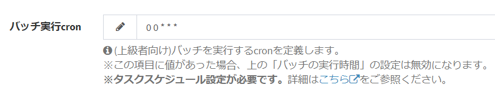

# プラグイン(バッチ) サンプル - 操作ログローテーション
Exmentの操作ログを、一定日付経過したものをデータベースから物理削除します。  
※既定は14日です。基準となる日数は、設定画面から変更できます。

## 実行方法
- プラグインをインストールします。

- 基準となる日数を変更する場合、プラグイン設定画面より、基準となる日数を変更し保存します。  
  

- #### バッチの実行時間(時)指定
プラグイン設定画面で、0～23を入力することで設定できます。  
毎日、上記の時間にプラグインが実行されます。（例：「5」と設定した場合、毎日5:00にプラグイン実行）  
  

- #### バッチ実行cron指定
上級者向けです。毎日のプラグインを実行するタイミングを、cron記法で入力できます。  
※この設定を記入した場合、上記の「バッチの実行時間(時)」は無効になります。  
  

- #### コマンド実行
コマンドラインを使用し、任意のタイミングで手動でバッチを実行することもできます。  
以下のコマンドのいずれかを実行してください。  

~~~
# プラグインID指定
php artisan exment:batch 1

# plugin_name(プラグイン名)指定
php artisan exment:batch --name=OperationLogRotate

# uuid指定
php artisan exment:batch --uuid=96937d87-6b53-cbe4-c1ff-c33e59948761
~~~  
