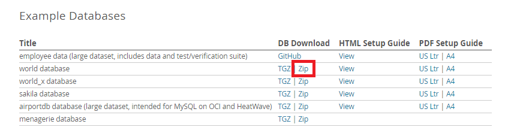
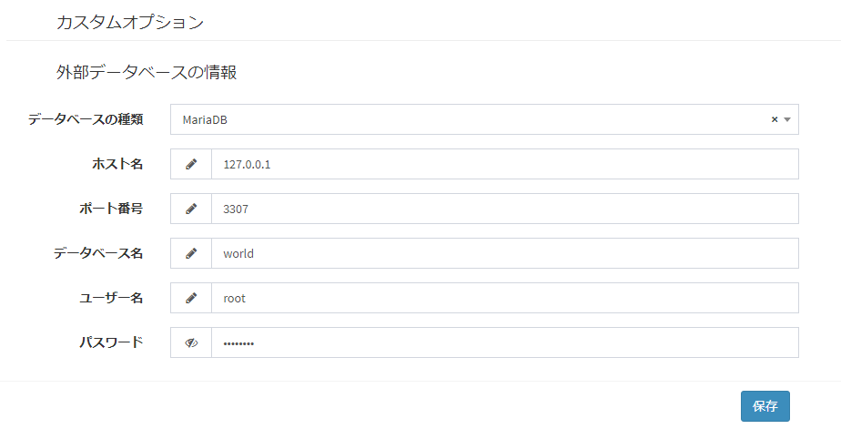
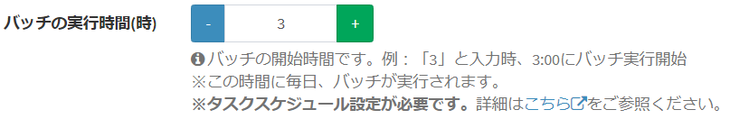
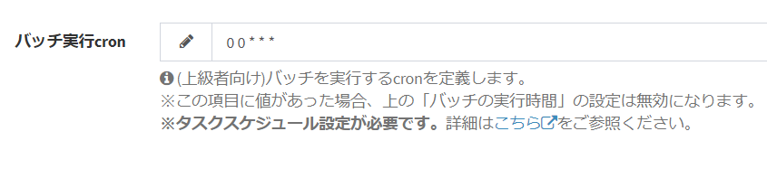

# プラグイン(バッチ) サンプル - 外部データベースのバッチによる同期処理
外部データベースの都市データをExmentのテーブルと一括同期します。

## 事前準備
事前準備として、以下の処理を実行してください。
- Exmentの管理者設定→テンプレートから、[テンプレート](https://exment.net/downloads/sample/template/city_template.zip)をインポートします。  
- 外部データベースを作成します。本プラグインではMySQLのサンプルデータベース「world」を利用しています。[公式サイト](https://dev.mysql.com/doc/index-other.html)からzipをダウンロードした上で、お使いのMySQL（またはMariaDB）環境で解凍したSQLを実行してください。
  
- Exmentの管理者設定→プラグインから、[プラグイン](https://exment.net/downloads/sample/plugin/PluginSyncBatch.zip)をアップロードします。  
- プラグインの設定画面を開き、2.で設定した外部データベースの接続情報を入力→保存してください。  
  

## 実行方法
- プラグインをインストールします。

- #### バッチの実行時間(時)指定
プラグイン設定画面で、0～23を入力することで設定できます。  
毎日、上記の時間にプラグインが実行されます。（例：「5」と設定した場合、毎日5:00にプラグイン実行）  
  

#### バッチ実行cron指定
上級者向けです。毎日のプラグインを実行するタイミングを、cron記法で入力できます。  
※この設定を記入した場合、上記の「バッチの実行時間(時)」は無効になります。  
  

#### コマンド実行
コマンドラインを使用し、任意のタイミングで手動でバッチを実行することもできます。  
以下のコマンドのいずれかを実行してください。  

~~~
# プラグインID指定
php artisan exment:batch 1

# plugin_name(プラグイン名)指定
php artisan exment:batch --name=harddelete_data

# uuid指定
php artisan exment:batch --uuid=b5c0a5d2-2716-4161-98d0-b490c1ebc521
~~~  

## 権限設定
プラグイン登録後に役割グループ設定で、権限の付与を行ってください。  
プラグインの権限としては以下の2種類があります。  
- "設定変更"はプラグイン管理の編集画面で設定を変更できる権限です。  
- "利用・アクセス"はプラグインのエンドポイントにアクセスしてCRUD機能を利用する権限です。  