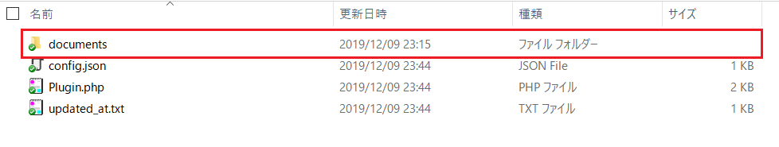

# プラグイン(Docurain) サンプル - Docurain
Docurainにより、PDFを作成するプラグインです。

## 事前準備
### テンプレートExcelファイル作成
帳票の元となるExcelファイルを作成します。  
※Excelファイルの名前に日本語は使用できません。拡張子は必ずxlsxでお願いします。  
※テンプレートファイルのパラメータは、通常のExmentのパラメータ記載方法とは異なり、Docurain専用の記載方法が必要です。  

#### パラメータ
テンプレートのExcelファイルに設定するパラメータです。
Excelセルに特定の形式の変数を入力することで、帳票出力時に、様々な値に変換されます。  

##### システム値
| 項目 | 説明 |
| ---- | ---- |
| %{system.site_name} | システムのサイト名 |
| %{system.site_name_short} | システムのサイト名(短縮) |
| %{system.system_mail_from} | システムの送信元 |
| %{system.system_url} | システムのホームURL |
| %{system.login_url} | システムのログインURL |

##### データ
| 項目 | 説明 |
| ---- | ---- |
| %{id} | 対象データのIDが設定されます。(例：123) |
| %{suuid} | 対象データの、suuid(Short UUID. 20桁のランダム文字列))が設定されます。 |
| %{value_url} | 対象データを表示するリンクが設定されます。 |
| %{value.(列名)} | 対象データの列の値が設定されます。(例：ユーザーデータに対し、%{value.user_code}と記入した場合、ユーザーコードが設定される) |
| %{select_table.(列名).(参照先のテーブルの列名)} | 「列名」に該当する列が、「選択肢 (他のテーブルの値一覧から選択)」「ユーザー」「組織」の場合、参照先の列の値が設定されます。(例：「契約情報(contract)」テーブルに「顧客(client)」列があり、「顧客情報(client)」テーブルを参照している場合、%{select_table.client.client_code}と設定すれば、「顧客情報(client)」テーブルの顧客コード(client_code)を表示できる) |
| %{parent.(参照先のテーブルの列名)} | 親テーブルの列の値が設定されます。(例：「契約明細情報(contract_detail)」テーブルから、親である「契約情報(contract)」テーブルの契約コード(contract_code)を参照する場合、%{parent.contract_code}と記入した場合、契約コードが設定される) |
| $ENTITY.children.(子テーブル名) | 「#foreach」などのブロック構文を用いて子テーブルの情報を設定します。子テーブルの情報は複数存在するケースがあるので、%{children.(子テーブル名).(子テーブルの列名)}のように設定することはできません。下記で一例を説明しています。 |

#### 設定例
##### 基本ルール
- 一般的なEXCEL関数や書式設定が使用可能です。  
- A列はロジック記述専用の列です。#ifや#foreach、#setなどのブロック構文を記述します。

##### ※テンプレートの一例   

- 上記テンプレートを出力した結果のPDFです。   

#### サンプルテンプレートのダウンロード
[ユーザー情報](https://exment.net/downloads/product/plugin/Docurain/user.xlsx)  
[製品バージョン情報](https://exment.net/downloads/product/plugin/Docurain/product_version.xlsx)  
[契約情報](https://exment.net/downloads/product/plugin/Docurain/contract.xlsx)  
※製品バージョン情報と契約情報を使用するためには、事前に「製品販売会社用テンプレート」をインポートする必要があります。

## 実行方法
- プラグインをインストールします。

- 以下の内容を入力します。

- 対象テーブル：Docurainを実行する対象のテーブル

  

- トークン：Docurain実行トークン。トークン発行は、[こちら](https://exment.net/inquiry)にてお問い合わせください

  

- テーブル名と帳票ファイル名一覧： 帳票出力を行うテーブル名とテンプレートファイル名、出力する帳票ファイル名、ボタンのラベルをカンマ区切りで入力してください。複数の場合は改行区切りを行ってください。  
※テンプレートファイル名に日本語は使用できません。（帳票ファイル名とボタンラベルには使用可能です）  
※帳票ファイル名を省略した場合はテンプレートファイル名になります。  
※ボタンのラベルを省略した場合はプラグイン共通で設定したラベルになります。  
※帳票ファイル名には日付などの[パラメータ](https://exment.net/docs/#/ja/params)を含めることができます。

  

- 解凍したフォルダ内の「documents」フォルダ内に、帳票の元となるExcelファイルを配置します。  
複数の帳票をDocurainで作成する場合、複数のExcelファイルをdocumentsに配置してください。  
※フォルダパスは、「(プロジェクトルートフォルダ)/storage/app/plugins/Docurain/documents」になります。  
※帳票の作成方法は、以下の「帳票作成方法」をご確認ください。

  
  

- ここまでの設定を行うことで、「対象テーブル」で選択したテーブルに、ボタンが表示されます。  

  

- ボタンをクリックすることで、帳票が作成されます。  

   

### エラーについて
- 出力の実行後、エラーが表示される場合があります。  
その場合はエラー内容をご確認いただき、対応を行ってください。

- エラーのうち、「HTTPステータスコード」が「413」のエラーは、Docurainのクラウドサービス側で、サービス許容値の変更対応を行う必要があります。  
その場合は、[こちら](https://exment.net/docurain)よりお問い合わせください。

## 権限設定
プラグイン登録後に役割グループ設定で、権限の付与を行ってください。  
プラグインの権限としては以下の2種類があります。  
- "設定変更"はプラグイン管理の編集画面で設定を変更できる権限です。  
- "利用・アクセス"はプラグインのエンドポイントにアクセスしてCRUD機能を利用する権限です。  