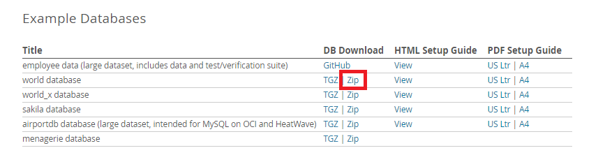
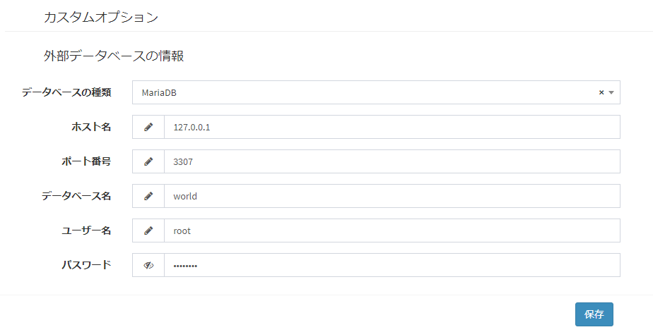

# プラグイン(イベント) サンプル - 外部データ連携
都市データの情報を外部データベースと連携します。

## 事前準備
- 事前準備として、以下の処理を実行してください。
    - Exmentの管理者設定→テンプレートから、[テンプレート](https://exment.net/downloads/sample/template/city_template.zip)をインポートします。  
    - 外部データベースを作成します。本プラグインではMySQLのサンプルデータベース「world」を利用しています。[公式サイト](https://dev.mysql.com/doc/index-other.html)からzipをダウンロードした上で、お使いのMySQL（またはMariaDB）環境で解凍したSQLを実行してください。
  
    - Exmentの管理者設定→プラグインから、[プラグイン](https://exment.net/downloads/sample/plugin/PluginSyncCity.zip)をアップロードします。  
    - プラグインの設定画面を開き、2.で設定した外部データベースの接続情報を入力→保存してください。  
    

## 権限設定
プラグイン登録後に役割グループ設定で、権限の付与を行ってください。  
プラグインの権限としては以下の2種類があります。  
- "設定変更"はプラグイン管理の編集画面で設定を変更できる権限です。  
- "利用・アクセス"はプラグインのエンドポイントにアクセスしてCRUD機能を利用する権限です。  