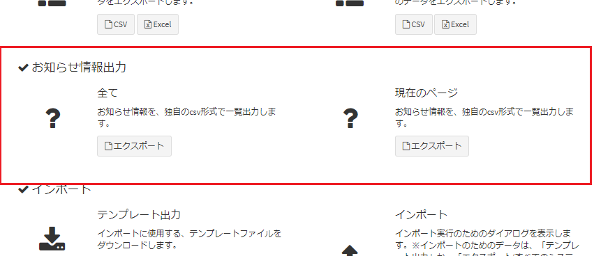

# プラグイン(エクスポート) サンプル - エクスポート(CSV)
CSVファイルをエクスポートするプラグインです。

## 実行方法
- プラグインをインストールします。

- プラグイン管理画面で登録したtarget_tablesの画面で、「インポート・エクスポート」ボタンをクリックすると、アップロードしたプラグインの選択欄が表示されます。  

  

- 登録したプラグインの「エクスポート」ボタンをクリックすると、Plugin.phpのexecute関数の内容でエクスポート処理が実行されます。  

### その他の制約
- PhpSpreadSheetの最新版(2022/02/25現在)である1.22.0では、以下の内容には対応していません。テンプレートには含めないようにお願いします。  
ファイルを最小構成として、zipに圧縮します。  
  - 挿入する図形   
  - グラフ  
  - 「テーブルとして書式設定」を行う表  
- 出力されたファイルに画像が含まれない場合、[こちら](https://exment.net/docs/#/ja/troubleshooting)の「Excelをテンプレートとしたドキュメント出力で、画像の出力に失敗する」をご確認ください。

## 権限設定
プラグイン登録後に役割グループ設定で、権限の付与を行ってください。  
プラグインの権限としては以下の2種類があります。  
- "設定変更"はプラグイン管理の編集画面で設定を変更できる権限です。  
- "利用・アクセス"はプラグインのエンドポイントにアクセスしてCRUD機能を利用する権限です。  