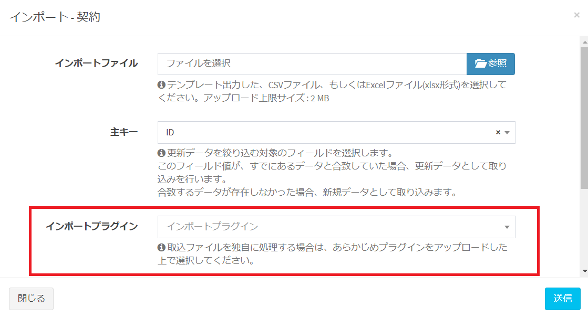

# プラグイン(インポート) サンプル - 独自ロジックによるインポート
契約データを独自ロジックでインポートします。

## 事前準備
見積書のヘッダ部分には契約テーブルに関する情報、明細部分には契約明細テーブルに関する情報が記載されているものとします。
  
## 実行方法
プラグイン管理画面で登録したtarget_tablesの画面で、インポートダイアログを開くと、インポートプラグインの選択欄が表示されます。登録したプラグインを選択して、送信ボタンを押下すると、Plugin.phpのexecute関数の内容でインポート処理が実行されます。  
  

## 権限設定
プラグイン登録後に役割グループ設定で、権限の付与を行ってください。  
プラグインの権限としては以下の2種類があります。  
- "設定変更"はプラグイン管理の編集画面で設定を変更できる権限です。  
- "利用・アクセス"はプラグインのエンドポイントにアクセスしてCRUD機能を利用する権限です。  