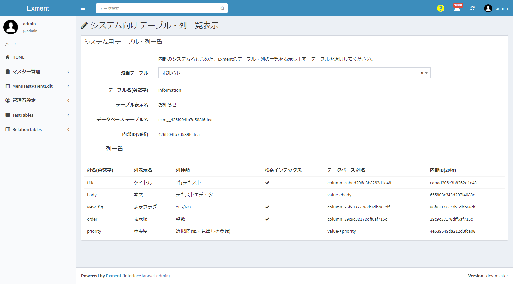

# プラグイン(ページ) サンプル - システムテーブル・列一覧
内部パラメータも含めた、Exmentのテーブル・列の一覧を表示します。

## イメージ図

## 事前準備
特にありません。

## 実行方法
- プラグインをインストールします。

- 以下のページにアクセスします。  
http(s)://(ExmentのURL)/plugins/system_table_column_list

- ページが表示されます。  
テーブルが表示されますので、該当テーブルを選択してください。
