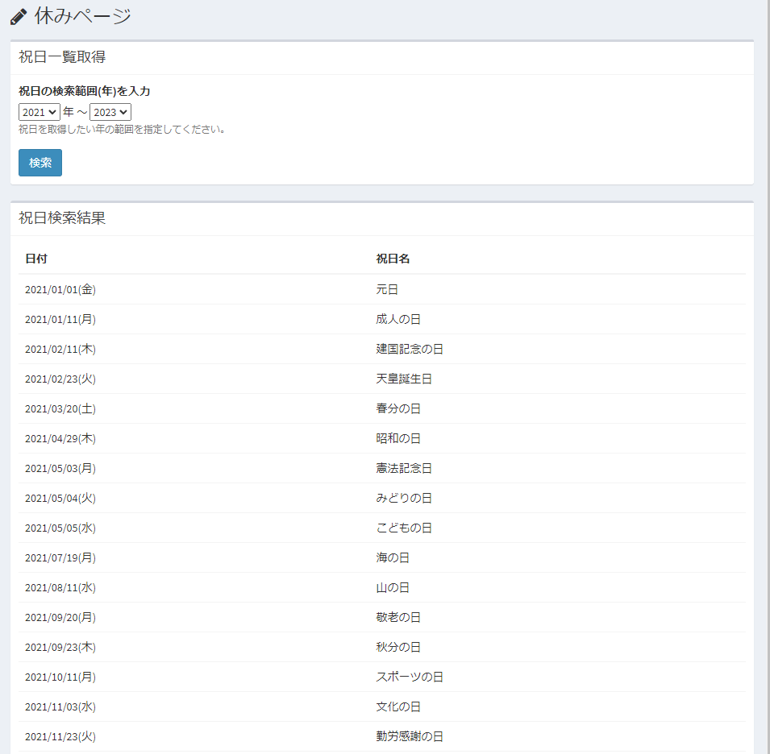

# プラグイン(ページ) サンプル - 休みページ
表示年の祝日をページに表示します。

## 主な機能

- 指定の年月の、祝日一覧を画面表示する。
- 取得対象の年範囲は、画面から設定可能。

## イメージ図


## 事前準備

- 以下のコマンドを実行し、[関連ライブラリ](https://github.com/azuyalabs/yasumi)をインストールしてください。

```
composer require azuyalabs/yasumi=^2.3
```

## 実行方法
- プラグインをインストールします。

- 以下のページにアクセスします。  
http(s)://(ExmentのURL)/plugins/yasumi_page

- ページが表示されます。  

