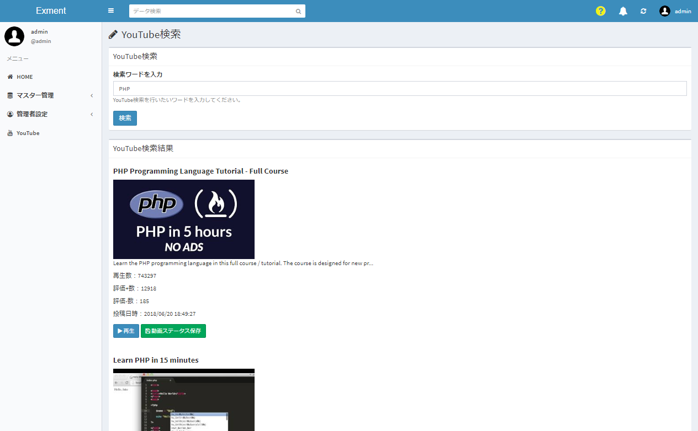

# プラグイン(ページ) サンプル - YouTube検索
YouTubeでデータ検索を行うプラグインです。

## 主な機能

- YouTubeでデータ検索を行うための検索バーを表示する。
- 入力した検索値で、YouTube検索を行い。上位20件を表示する。
- 「登録」ボタンをクリックした動画の、動画IDとタイトル、説明文、リンク、再生数、高評価数、低評価数を、テーブル「YouTube」に登録する。

## イメージ図

## 事前準備

- 実行には、YouTubeのアクセスキーが必要です。[こちら](https://qiita.com/shinkai_/items/10a400c25de270cb02e4)を参考に、キーを取得してください。  
  
- 事前に、[こちら](https://exment.net/downloads/sample/template/YouTube.zip)のテンプレートをインポートしてください。

## 実行方法
- プラグインをインストールします。

- 以下のページにアクセスします。  
http(s)://(ExmentのURL)/plugins/you_tube_search

- ページが表示されます。  

