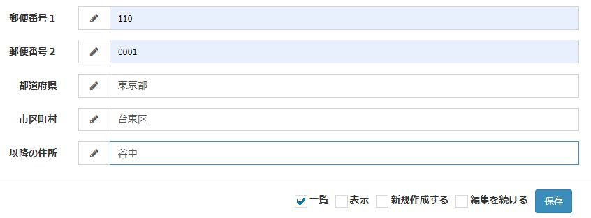
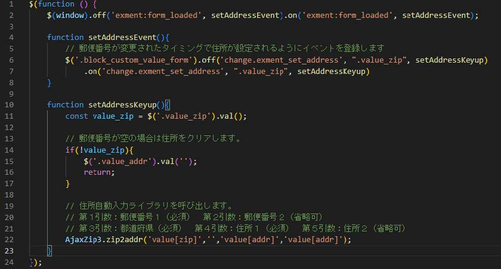
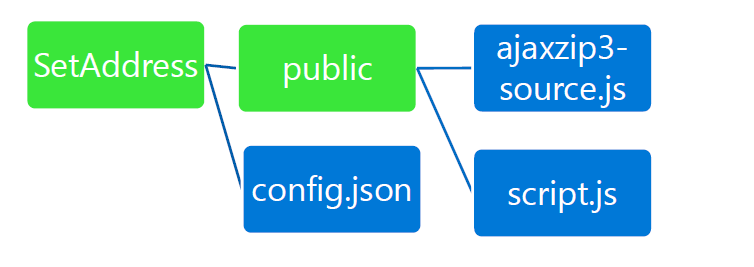
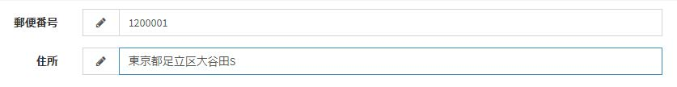
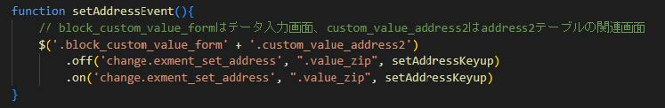

# プラグイン(スクリプト) サンプル - 入力フォーム 住所セット
入力フォームの郵便番号を使用し、住所をセットします。

## 実行方法
- プラグインをインストールします。

- 該当プラグインの管理ページで有効フラグをYESにします。

- 前提条件として下記のカスタム列を持つテーブルが必要です。（カッコ内は英数字名）  
 「郵便番号１（zip01）」「郵便番号２（zip02）」
 「都道府県（pref）」「市区町村（addr01）」「以降の住所（addr02）」

- 郵便番号１または２に値を入力すると、都道府県/市区町村/以降の住所に自動的に該当する住所が設定されます。

# サンプルプラグインのカスタマイズ（住所自動入力）
- 郵便番号と住所がそれぞれ１つしかないテーブル向けにカスタマイズを行います。「郵便番号（zip）」「住所（addr）」
- 下記を参考にして、サンプルプラグインに含まれた「script.js」を修正してください。

#### SetAddressプラグインのフォルダ階層

- 郵便番号と住所が１つしかないテーブルでも自動入力ができるようになります。

※補足事項）  
プラグインでアップロードしたスクリプトはすべての画面で実行されることになります。  
対象画面を限定する場合は以下のようにテーブル名のクラスを指定してください。  

