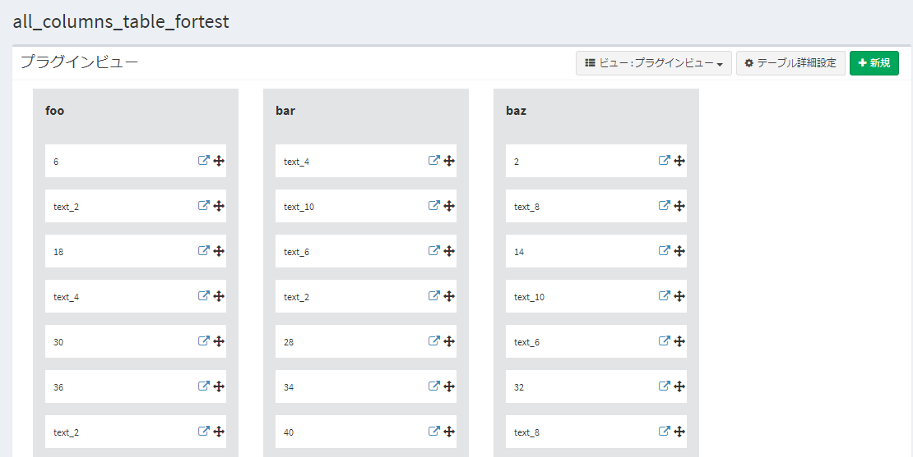

# プラグイン(ビュー) サンプル - かんばんビュー
シンプルなかんばんビューを表示するプラグインです。
   
## 実行方法
- プラグインをインストールします。

- 該当プラグインの管理ページで、かんばんビューを使用する対象テーブルなどの設定を行います。

- 対象テーブルのビュー設定で「かんばんビュー」を選び、カテゴリ列の選択などを設定します。  
※「カテゴリ」に該当する列はビュー設定で適宜選択可能としている為、複数のテーブルで同じプラグインが使用可能となっています。

- 作成した「かんばんビュー」でデータ一覧を表示します。

   

#### (任意)ビューについて
ビューを分離する場合、bladeファイルはフォルダ「resources/views」以下に保存してください。  

#### (任意)css、js、それ以外の静的ファイルについて
- cssファイルは、フォルダ「public/css」に配置してください。  
- jsファイルは、フォルダ「public/js」に配置してください。  
- それ以外のファイル(画像ファイルなど)は、フォルダ「public/assets」に配置してください。  
※本サンプルでは、かんばんビューを作成するためのjs・cssを作成しています。

## 権限設定
プラグイン登録後に役割グループ設定で、権限の付与を行ってください。  
プラグインの権限としては以下の2種類があります。  
- "設定変更"はプラグイン管理の編集画面で設定を変更できる権限です。  
- "利用・アクセス"はプラグインのエンドポイントにアクセスしてCRUD機能を利用する権限です。  